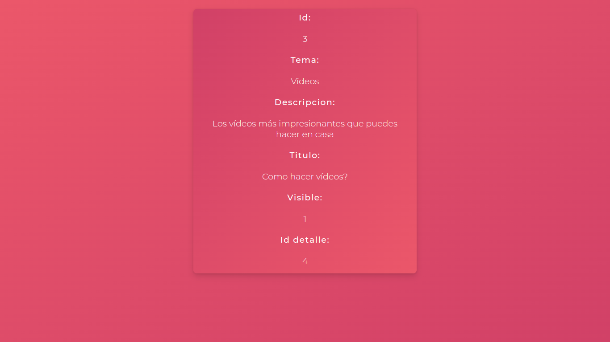

#  **Prueba tecnica para desarrollador como tecnologo 04**

Andrés Felipe Martín Rodríguez [][1]

## Tecnologías utilizadas
Para desarrollar el frontend de este proyecto, se utilizo:

1. [NPM][6]
2. [ReactJS][3]
2. [SCSS][4]

# Instrucciones para correrlo

Se deben tener instaladas las tecnologías mencionadas anteriormente: principalmente NPM
Luego, vamos a instalar las dependencias, accediendo a la carpeta del repositorio y ejecutando:

    npm i

Y para ejecutar el proyecto, utilizamos:

    npm run dev

# Evidencia de Funcionamiento

La URI para ver la página es `http://localhost:5173` por defecto.

 [1]:https://gitlab.com/felimarod
 [2]:https://github.com/felimarod/prueba-desarrollador-backend.git
 [3]:https://reactjs.org
 [4]:https://sass-lang.com
 [6]:https://www.npmjs.com